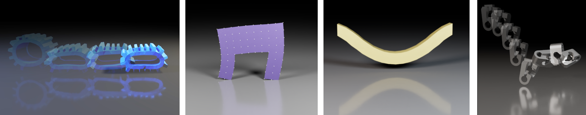
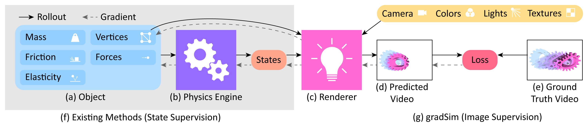
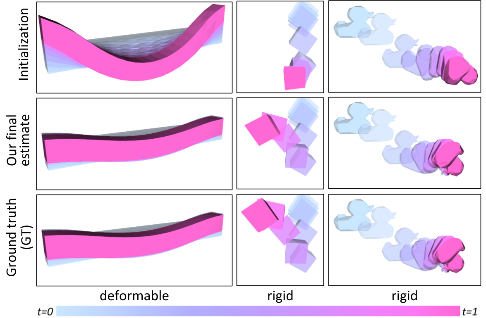
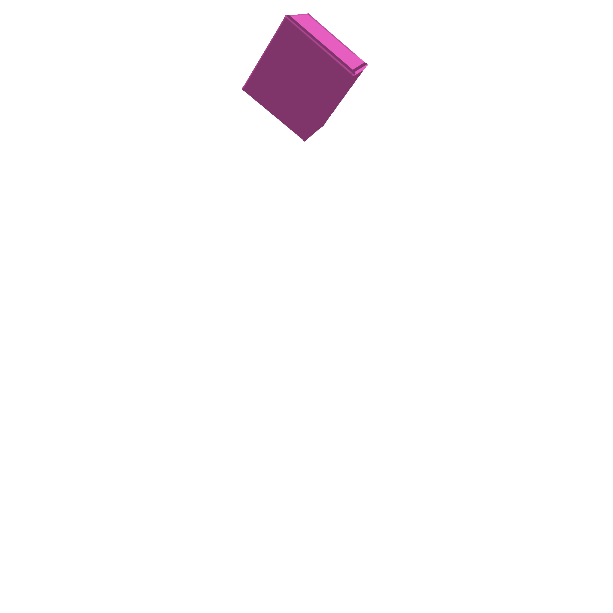
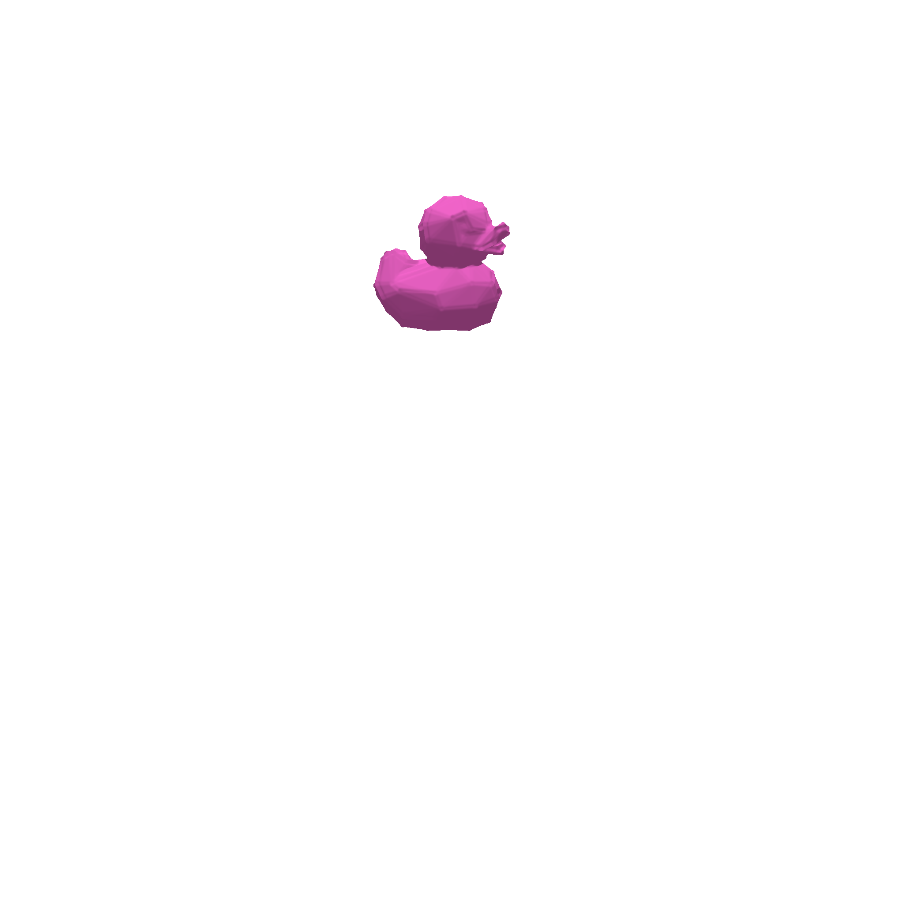
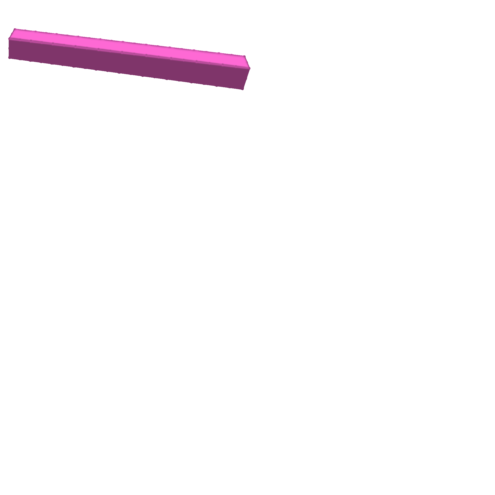
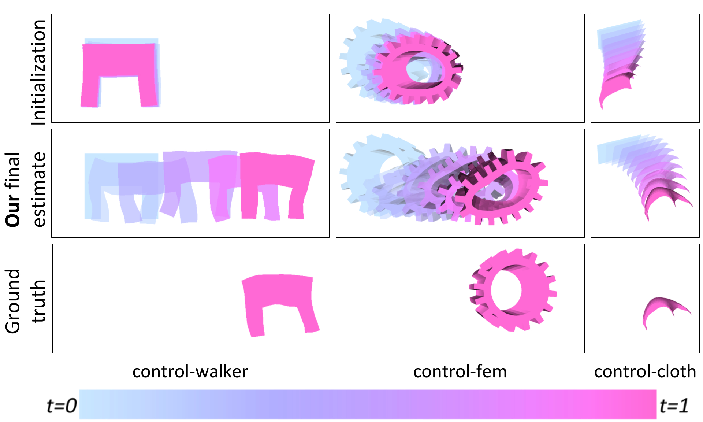
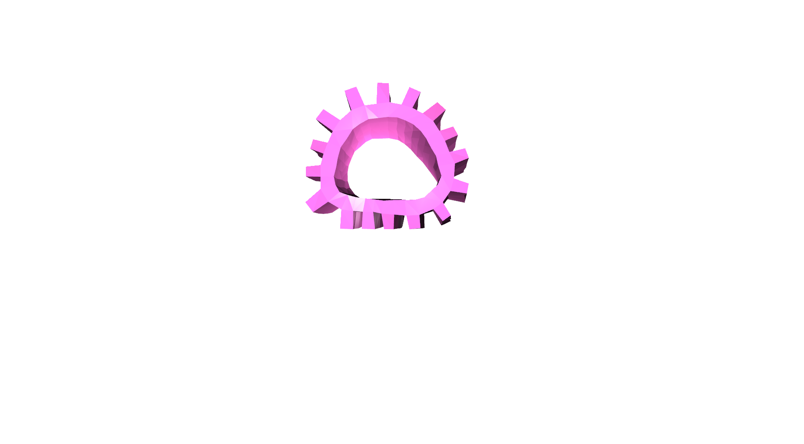

## Abstract

We consider the problem of estimating an object's physical properties such as mass, friction, and elasticity directly from video sequences. Such a system identification problem is fundamentally ill-posed due to the loss of information during image formation. Current solutions require precise 3D labels which are labor-intensive to gather, and infeasible to create for many systems such as deformable solids or cloth. We present gradSim, a framework that overcomes the dependence on 3D supervision by leveraging differentiable multiphysics simulation and differentiable rendering to jointly model the evolution of scene dynamics and image formation. This novel combination enables backpropagation from pixels in a video sequence through to the underlying physical attributes that generated them. Moreover, our unified computation graph -- spanning from the dynamics and through the rendering process -- enables learning in challenging visuomotor control tasks, without relying on state-based (3D) supervision, while obtaining performance competitive to or better than techniques that rely on precise 3D labels.

[here]: https://gradsim.github.io

______

	</img>
	<figcaption>
	Figure 1: <b>gradSim</b> is a unified differentiable rendering and multiphysics framework that allows solving a range of control and parameter estimation tasks (rigid bodies, deformable solids, and cloth) directly from images/video.
	</figcaption>

## Introduction

Accurately predicting the dynamics and physical characteristics of objects from image sequences is a long-standing challenge in computer vision.
This end-to-end reasoning task requires a fundamental understanding of *both* the underlying scene dynamics and the imaging process. Imagine watching a short video of a basketball bouncing off the ground and ask: "*Can we infer the mass and elasticity of the ball, predict its trajectory, and make informed decisions, e.g., how to pass and shoot?*" These seemingly simple questions are extremely challenging to answer even for modern computer vision models. The underlying physical attributes of objects and the system dynamics need to be modeled and estimated,  all while accounting for the loss of information during 3D to 2D image formation.

Depending on the assumptions on the scene structre and dynamics, three types of solutions exist: *black*, *grey*, or *white box*. *Black box* methods<dt-cite key="visualinteractionnets"></dt-cite><dt-cite key="densephysnet"></dt-cite><dt-cite key="object_oriented_prediction_and_planning"></dt-cite><dt-cite key="compositional_object_based"></dt-cite> model the state of a dynamical system (such as the basketball's trajectory in time) as a learned embedding of its states or observations. These methods require few prior assumptions about the system itself, but lack interpretability due to entangled variational factors <dt-cite key="infogan"></dt-cite> or due to the ambiguities in unsupervised learning <dt-cite key="greydanus2019hamiltonian"></dt-cite><dt-cite key="cranmer2020lagrangian"></dt-cite>. Recently, *grey box* methods <dt-cite key="nds"></dt-cite> leveraged partial knowledge about the system dynamics to improve performance. In contrast, *white box* methods <dt-cite key="differentiable_physics_engine_for_robotics"></dt-cite><dt-cite key="differentiablecloth"></dt-cite><dt-cite key="difftaichi"></dt-cite><dt-cite key="scalable-diffphysics"></dt-cite> impose prior knowledge by employing explicit dynamics models, reducing the space of learnable parameters and improving system interpretability. Most notably in our context, all of these approaches require precise 3D labels -- which are labor-intensive to gather, and infeasible to generate for many systems such as deformable solids or cloth.

**We eliminate the dependence of white box dynamics methods on 3D supervision by coupling explicit (and differentiable) models of scene dynamics with image formation (rendering).** (*Dynamics* refers to the laws governing the motion and deformation of objects over time. *Rendering* refers to the interaction of these scene elements -- including their material properties -- with scene lighting to form image sequences as observed by a virtual camera. *Simulation* refers to a unified treatment of these two processes.)

Explicitly modeling the end-to-end dynamics and image formation underlying video observations is challenging, even with access to the full system state. This problem has been treated in the vision, graphics, and physics communities <dt-cite key="pbrt"></dt-cite><dt-cite key="miles-flex"></dt-cite>, leading to the development of robust forward simulation models and algorithms. These simulators are not readily usable for solving *inverse* problems, due in part to their non-differentiability. As such, applications of black-box *forward processes* often require surrogate gradient estimators such as finite differences or REINFORCE<dt-cite key="reinforce"></dt-cite> to enable any learning. Likelihood-free inference for black-box forward simulators<dt-cite key="bayessim"></dt-cite><dt-cite key="cranmer2019frontier"></dt-cite><dt-cite key="kulkarni_picture"></dt-cite><dt-cite key="causal_and_compositional_generative_models"></dt-cite><dt-cite key="analysis_by_synthesis_in_vision"></dt-cite><dt-cite key="inverse_graphics_face_processing"></dt-cite><dt-cite key="nsd"></dt-cite> has led to some improvements here, but remains limited in terms of data efficiency and scalability to high dimensional parameter spaces. Recent progress in *differentiable simulation* further improves the learning dynamics, however we still lack a method for end-to-end differentiation through the entire simulation process (i.e., from video pixels to physical attributes), a prerequisite for effective learning from video frames alone.

We present gradSim, a versatile end-to-end differentiable simulator that adopts a holistic, unified view of differentiable dynamics and image formation (see Fig. 1, Fig. 2). Existing differentiable physics engines only model time-varying dynamics and require supervision in *state space* (usually 3D tracking). We additionally model a differentiable image formation process, thus only requiring target information specified in *image space*. This enables us to  backpropagate <dt-cite key="griewank_ad"></dt-cite> training signals from video pixels all the way to the underlying physical and dynamical attributes of a scene.

	</img>
	<figcaption>
	Figure 2: <b>gradSim</b>: Given video observations of an evolving physical system (e), we randomly initialize scene object properties (a) and evolve them over time using a differentiable physics engine (b), which generates *states*. Our renderer (c) processes states, object vertices and global rendering parameters to produce image frames for computing our loss. We backprop through this computation graph to estimate physical attributes and controls. Existing methods rely solely on differentiable physics engines and require supervision in state-space (f), while gradSim only needs image-space supervision (g).
	</figcaption>

Our main contributions are: 
* gradSim, a differentiable simulator that demonstrates the ability to backprop from video pixels to the underlying physical attributes (Fig. 1, Fig. 2).
* We demonstrate recovering many physical properties exclusively from video observations, including friction, elasticity, deformable material parameters, and visuomotor controls (sans 3D supervision)
* A PyTorch framework facilitating interoperability with existing machine learning modules.

We evaluate gradSim's effectiveness on parameter identification tasks for rigid, deformable and thin-shell bodies, and demonstrate performance that is competitive, or in some cases superior, to current physics-only differentiable simulators. Additionally, we demonstrate the effectiveness of the gradients provided by gradSim on challenging visuomotor control tasks involving deformable solids and cloth.

______

## gradSim: A unified differentiable simulation engine

Typically, physics estimation and rendering have been treated as disjoint, mutually exclusive tasks. In this work, we take on a unified view of \emph{simulation} in general, to compose physics estimation \emph{and} rendering. Formally, simulation is a function

$\text{Sim}: \mathbb{R}^P \times \left[0, 1\right] \mapsto \mathbb{R}^H \times \mathbb{R}^W; \text{Sim}(\mathbf{p}, t) = \mathcal{I}$.

Here $\mathbf{p} \in \mathbb{R}^P$ is a vector representing the simulation state and parameters (objects, their physical properties, their geometries, etc.), $t$ denotes the time of simulation. Given initial conditions $\mathbf{p}_0$, the simulation function produces an image $\mathcal{I}$ of height $H$ and width $W$ at each timestep $t$. If this function $\text{Sim}$ were differentiable, then the gradient of $\text{Sim}(\mathbf{p}, t)$ with respect to the simulation parameters $\mathbf{p}$ provides the change in the output of the simulation from $\mathcal{I}$ to $\mathcal{I} + \nabla \text{Sim}(\mathbf{p}, t)\delta\mathbf{p}$ due to an *infinitesimal perturbation* of $\mathbf{p}$ by $\delta\mathbf{p}$. This construct enables a gradient-based optimizer to estimate physical parameters from video, by defining a *loss function* over the image space $\mathcal{L}(\mathcal{I}, .)$, and descending this loss landscape along a direction parallel to $- \nabla \text{Sim}(.)$.To realise this, we turn to the paradigms of *computational graphs* and *differentiable programming*.

gradSim comprises two main components: a *differentiable physics engine* that computes the physical states of the scene at each time instant, and a *differentiable renderer* that renders the scene to a 2D image. Contrary to existing differentiable physics<dt-cite key="Toussaint-RSS-18"></dt-cite><dt-cite key="differentiable_lcp_kolter"></dt-cite><dt-cite key="song2020learning"></dt-cite><dt-cite key="song2020identifying"></dt-cite><dt-cite key="differentiable_physics_engine_for_robotics"></dt-cite><dt-cite key="vda"></dt-cite><dt-cite key="tiny_diff_simulator"></dt-cite><dt-cite key="difftaichi"></dt-cite><dt-cite key="scalable-diffphysics"></dt-cite> or differentiable rendering <dt-cite key="opendr"></dt-cite><dt-cite key="NMR"></dt-cite><dt-cite key="softras"></dt-cite><dt-cite key="dibr"></dt-cite> approaches, we adopt a holistic view and construct a computational graph spanning them both.

### Differentiable physics engine

Under Lagrangian mechanics, the state of a physical system can be described in terms of generalized coordinates $\mathbf{q}$, generalized velocities $\dot{\mathbf{q}} = \mathbf{u}$, and design/model parameters $\mathbf{\theta}$. For the purpose of exposition, we make no distinction between rigid bodies, or deformable solids, or thin-shell models of cloth, etc. Although the specific choices of coordinates and parameters vary, the simulation procedure is virtually unchanged. We denote the combined state vector by $\mathbf{s}(t) = \left[\mathbf{q}(t), \mathbf{u}(t)\right]$.

The dynamic evolution of the system is governed by second order differential equations (ODEs) of the form $\mathbf{M}(\mathbf{s}, \theta\ )\dot{\mathbf{s}} = \mathbf{f}(\mathbf{s}, \theta)$, where $\mathbf{M}$ is a mass matrix that depends on the state and parameters. The forces on the system may be parameterized by design parameters (e.g. Young's modulus). Solutions to these ODEs  may be obtained through black box numerical integration methods, and their derivatives calculated through the continuous adjoint method<dt-cite key="neuralode"></dt-cite>. However, we instead consider our physics engine as a differentiable operation that provides an implicit relationship between a state vector $\mathbf{s}^- = \mathbf{s}(t)$ at the start of a time step, and the updated state at the end of the time step $\mathbf{s}^+ = \mathbf{s}(t + \dt)$. An arbitrary discrete time integration scheme can be then be abstracted as the function $\mathbf{g}(\mathbf{s}^-, \mathbf{s}^+, \theta) = \mathbf{0}$, relating the initial and final system state and the model parameters $\theta$.

Gradients through this dynamical system can be computed by graph-based autodiff frameworks<dt-cite key="pytorch"></dt-cite><dt-cite key="tensorflow"></dt-cite><dt-cite key="jax"></dt-cite>, or by program transformation approaches<dt-cite key="difftaichi"></dt-cite><dt-cite key="tangent"></dt-cite>. Our framework is agnostic to the specifics of the differentiable physics engine, however in the appendix of our paper, we detail an efficient approach based on the source-code transformation of parallel kernels, similar to  DiffTaichi<dt-cite key="difftaichi"></dt-cite>. In addition, we describe extensions to this framework to support mesh-based tetrahedral finite-element models (FEMs) for deformable and thin-shell solids. This is important since we require surface meshes to perform differentiable rasterization as described in the following section.

### Differentiable rendering engine

A renderer expects a *scene description* as input and generates color images as output, all according to a sequence of image formation stages defined by the *forward* graphics pipeline. The scene description includes a complete *geometric* descriptor of scene elements, their associated material/reflectance properties, light source definitions, and virtual camera parameters. The rendering process is not generally differentiable, as *visibility* and *occlusion* events introduce discontinuities. Most interactive renderers, such as those used in real-time applications, employ a *rasterization* process to project 3D geometric primitives onto 2D pixel coordinates, resolving these visibility events with non-differentiable operations.

Our experiments employ two differentiable alternatives to traditional rasterization, SoftRas<dt-cite key="softras"></dt-cite> and DIB-R<dt-cite key="dibr"></dt-cite>, both of which replace discontinuous triangle mesh edges with smooth sigmoids. This has the effect of blurring triangle edges into semi-transparent boundaries, thereby removing the non-differentiable discontinuity of traditional rasterization. DIB-R distinguishes between *foreground pixels* (associated to the principal object being rendered in the scene) and *background pixels* (for all other objects, if any). The latter are rendered using the same technique as SoftRas while the former are rendered by bilinearly sampling a texture using differentiable UV coordinates.

*gradSim performs differentiable physics simulation and rendering at independent and adjustable rates, allowing us to trade computation for accuracy by rendering fewer frames than dynamics updates.*

______

## Experiments

We conducted multiple experiments to test the efficacy of gradSim on *physical parameter identification from video* and *visuomotor control*, to address the following questions:
* Can we accurately identify physical parameters by backpropagating from video pixels, through the simulator? (Ans: *Yes, very accurately*)
* What is the performance gap associated with using gradSim (2D supervision) vs. differentiable physics-only engines (3D supervision)? (Ans: *gradSim is  competitive/superior*
* How do loss landscapes differ across differentiable simulators gradSim and their non-differentiable counterparts? (Ans: *Loss landscapes for gradSim are smooth*)
* Can we use gradSim for visuomotor control tasks? (Ans: *Yes, without any 3D supervision*)
* How sensitive is gradSim to modeling assumptions at system level? (Ans: *Moderately*)

Each of our experiments comprises an *environment* $\mathcal{E}$ that applies a particular set of physical forces and/or constraints, a (differentiable) *loss function* $\mathcal{L}$ that implicitly specifies an objective, and an *initial guess* $\mathbf{\theta}_0$ of the physical state of the simulation. The goal is to recover optimal physics parameters $\mathbf{\theta}^{*}$ that minimize $\mathcal{L}$, by backpropagating through the simulator.

### Physical parameter estimation from video

First, we assess the capabilities of gradSim to accurately identify a variety of physical attributes such as mass, friction, and elasticity from image/video observations. To the best of our knowledge, gradSim is the first study to *jointly* infer such fine-grained parameters from video observations. We also implement a set of competitive baselines that use strictly more information on the task.

	</img>
	<figcaption>
	Figure 3: <b>Parameter Estimation</b>: For <i>deformable</i> experiments, we optimize the material properties of a beam to match a video of a beam hanging under gravity. In the <i>rigid</i> experiments, we estimate contact parameters (elasticity/friction) and object density to match a video (GT). We visualize entire time sequences (t) with color-coded blends.
	</figcaption>

#### Rigid bodies

Our first environment--*rigid*--evaluates the accuracy of estimating of physical and material attributes of rigid objects from videos. We curate a dataset of $10000$ simulated videos generated from variations of $14$ objects, comprising primitive shapes such as boxes, cones, cylinders, as well as non-convex shapes from ShapeNet<dt-cite key="ShapeNet"></dt-cite>and DexNet<dt-cite key="dexnet2"></dt-cite>. With uniformly sampled initial dimensions, poses, velocities, and physical properties (density, elasticity, and friction parameters), we apply a *known* impulse to the object and record a video of the resultant trajectory. Inference with gradSim is done by guessing an initial mass (uniformly random in the range $[2, 12] kg/m^3$), unrolling a *differentiable* simulation using this guess, comparing the rendered out video with the true video (pixelwise mean-squared error - MSE), and performing gradient descent updates. We refer the interested reader to the appendix of our paper for more details.

| Approach                    											| Mean abs. err. (kg) | Abs. rel. err. |
|-----------------------------------------------------------------------|---------------------|----------------|
| Average                     											| 0.2022              | 0.1031         |
| Random                      											| 0.2653              | 0.1344         |
| ConvLSTM <dt-cite key="densephysnet"></dt-cite>                  	 	| 0.1347              | 0.0094         |
| PyBullet + REINFORCE <dt-cite key="ehsani2020force"></dt-cite>        | 0.0928              | 0.3668         |
| DiffPhysics (3D Supervsion) 											| 1.35e-9             | 5.17e-9        |
| gradSim (Ours)              											| 2.36e-5             | 9.01e-5        |

	<figcaption>
	Table 1: <b>Mass estimation</b>: gradSim obtains <i>precise</i> mass estimates, comparing favourably even with approaches that require 3D supervision (<i>diffphysics</i>). We report the mean abolute error and absolute relative errors for all approaches evaluated.
	</figcaption>

Table 1 shows the results for predicting the mass of an object from video, with a known impulse applied to it. We use EfficientNet (B0)<dt-cite key="efficientnet"></dt-cite> and resize input frames to $64 \times 64$. Feature maps at a resoluition of $4 \times 4 \times 32$ are concatenated for all frames and fed to an MLP with 4 linear layers, and trained with an MSE loss. We compare gradSim with three other baselines: PyBullet + REINFORCE<dt-cite key="ehsani2020force"></dt-cite><dt-cite key="galileo"></dt-cite>, diff. physics only (requiring 3D supervision), and a ConvLSTM baseline adopted from <dt-cite key="densephysnet"></dt-cite> but with a stronger backbone. The *DiffPhysics* baseline is a strict subset of gradSim, it only inolves the differentiable physics engine. However, it needs precise 3D states as supervision, which is the primary factor for its superior performance. Nevertheless, gradSim is able to very precisely estimate mass from video, to a absolute relative error of 9.01e-5, nearly two orders of magnitude better than the ConvLSTM baseline. Two other baselines are also used: the *Average* baseline always predicts the dataset mean and the *Random* baseline predicts a random parameter value from the test distribution.

To investigate whether analytical *differentiability* is required, our PyBullet + REINFORCE baseline applies black-box gradient estimation<dt-cite key="reinforce"></dt-cite> through a non-differentiable simulator<dt-cite key="pybullet"></dt-cite>, similar to<dt-cite key="ehsani2020force"></dt-cite>. We find this baseline particularly sensitive to several simulation parameters, and thus worse-performing. In Table 2, we jointly estimate friction and elasticity parameters of our compliant contact model from video observations alone. Here again, gradSim is able to precisely recover the parameters of the simulation. A few examples can be seen in Fig. 3. Parameter identification results on rigid objects can also be seen in Fig. 4 and Fig. 5.

| Approach                                        | mass    | elasticity ($k_d$) | elasticity ($k_e$) | friction ($k_f$) | friction ($\mu$) |
|-------------------------------------------------|---------|--------------------|--------------------|------------------|------------------|
| Average                                         | 1.771   | 3.715              | 2.341              | 4.116            | 0.446            |
| Random                                          | 10.001  | 4.180              | 2.545              | 5.024            | 0.556            |
| ConvLSTM <dt-cite key="densephysnet"></dt-cite> | 0.029   | 0.140              | 0.140              | 0.170            | 0.096            |
| DiffPhysics (3D Supervsion)                     | 1.70e-8 | 0.036              | 0.002              | 0.001            | 0.011            |
| gradSim (Ours)                                  | 2.87e-4 | 0.400              | 0.003              | 0.001            | 0.007            |

	<figcaption>
	Table 2: <b>Rigid-body parameter estimation</b>: gradSim estimates contact parameters (elasticity, friction) to a high degree of accuracy, despite estimating them from video. *DiffPhysics* requires accurate 3D ground-truth at $30$ FPS. We report absolute *relative* errors for each approach evaluated.
	</figcaption>

	</img>
	</img>
	</img>
	<figcaption>
	Figure 4: <b>Mass estimation</b> of a rigid cube. (Left) Initial estimate of mass is erroneous (heavier); hence the generated cube does not bounce upon impact. (Middle) gradSim obtains <i>precise</i> mass estimates within 100 iterations of gradient descent. (Right) Ground-truth video used for generating an error signal. The mean-squared error between the ground-truth video and the initial guess is used to generate the loss signal at the first iteration. Thereafter, the parameters are updated by gradient descent.
	</figcaption>

	</img>
	</img>
	</img>
	<figcaption>
	Figure 5: <b>Friction estimation</b> of a rigid object. (Left) Initial estimate of friction is erroneous, and the object attains a different final-configuration upon impact. (Middle) gradSim obtains <i>precise</i> friction estimates within 100 iterations of gradient descent. (Right) Ground-truth video used for generating an error signal. The mean-squared error between the ground-truth video and the initial guess is used to generate the loss signal at the first iteration. Thereafter, the parameters are updated by gradient descent.
	</figcaption>

#### Deformable objects

We conduct a series of experiments to investigate the ability of gradSim to recover physical parameters of deformable solids and thin-shell solids (cloth). Our physical model is parameterized by the per-particle mass, and Lame elasticity parameters, as described in the Appendix. Fig. 4 illustrates the recovery of the elasticity parameters of a beam hanging under gravity by matching the deformation given by an input video sequence. We found our method is able to accurately recover the parameters of $100$ instances of deformable objects (cloth, balls, beams) as reported in Table 3 and Fig. 3. The animation in Fig. 6 better illustrates the accuracy in material parameter estimation achieved by gradSim.

| Approach                    | Deformable solid - mass | Material parameter $\mu$ | Material parameter $\lambda$ | Cloth - per-particle velocity |
|-----------------------------|-------------------------|--------------------------|------------------------------|-------------------------------|
| DiffPhysics (3D Supervsion) | 0.032                   | 0.0025                   | 0.0024                       | 0.127                         |
| gradSim (Ours)              | 0.048                   | 0.0054                   | 0.0056                       | 0.026                         |

	<figcaption>
	Table 3: <b>Parameter estimation of deformable objects</b>: We estimate per-particle masses and material properties (for solid def. objects) and per-particle velocities for cloth. In the case of cloth, there is a perceivable performance drop in *DiffPhysics*, as the center of mass of a cloth is often outside the body, which results in ambiguity.
	</figcaption>

	</img>
	</img>
	</img>
	<figcaption>
	Figure 6: <b>Material property estimation</b> of a deformable solid beam. (Left) Initial material properties (Lame parameters) are erroneous, resulting in a soggy beam. (Middle) gradSim obtains <i>precise</i> material properties within 200 iterations of gradient descent. (Right) Ground-truth video used for generating an error signal.
	</figcaption>

### Visuomotor control

To investigate whether the gradients computed by gradSim are meaningful for vision-based tasks, we conduct a range of *visuomotor control* experiments involving the actuation of deformable objects towards a *visual target pose (a single image). In all cases, we evaluate against *DiffPhysics*, which uses a goal specification and a reward, both defined over the 3D *state-space*. See Fig. 7 for a summary of the experiments.

	</img>
	<figcaption>
	Figure 7: <b>Visuomotor Control</b>: gradSim provides gradients suitable for diverse, complex visuomotor control tasks. For *control-fem* and *control-walker* experiments, we train a neural network to actuate a soft body towards a target *image* (GT). For *control-cloth*, we optimize the cloth's initial velocity to hit a target (GT) (specified as an image), under nonlinear lift/drag forces.
	</figcaption>

#### Deformable solids

The first example (*control-walker*) involves a 2D walker model. Our goal is to train a neural network (NN) control policy to actuate the walker to reach a target pose on the right-hand side of an image. Our NN consists of one fully connected layer and a $\textnormal{tanh}()$ activation. The network input is a set of $8$ time-varying sinusoidal signals, and the output is a scalar activation value per-tetrahedron. gradSim is able to \emph{solve} this environment within three iterations of gradient descent, by minimizing a pixelwise MSE between the last frame of the rendered video and the goal image as shown in Fig. 7 (lower left), and more descriptively in Fig. 8.

	</img>
	</img>
	</img>
	</img>
	<figcaption>
	Figure 8: <b>Visuomotor control of a 2D walker</b>: (Left-to-right) The (randomly initialized) walker wiggles in-place during the first iteration; In the second iteration, the walker begins walking towards the goal configuration; In the third iteration, the walker successfully reaches the goal configuration; Target image specifying a goal configuration for the 2D walker.
	</figcaption>

In our second test, we formulate a more challenging 3D control problem (*control-fem*) where the goal is to actuate a soft-body FEM object (a *gear*) consisting of $1152$ tetrahedral elements to move to a target position as shown in Fig. 7 (center) and in Fig. 9. We use the same NN architecture as in the 2D walker example, and use the Adam<dt-cite key="kingma2015adam"></dt-cite> optimizer to minimize a pixelwise MSE loss. We also train a privileged baseline (*DiffPhysics*) that uses strong supervision and minimizes the MSE between the target position and the precise 3D location of the center-of-mass (COM) of the FEM model at each time step (i.e. a *dense* reward). While Diffphysics appears to be a strong performer on this task, it is important to  note that it uses explicit 3D supervision at each timestep (i.e. $30$ FPS). In contrast, gradSim uses a *single image* as an implicit target, and yet manages to achieve the goal state, albeit taking a longer number of iterations.

	</img>
	</img>
	</img>
	<figcaption>
	Figure 9: <b>Visuomotor control of a 3D gear</b>: (Left) The (randomly initialized) gear wiggles in-place during the first iteration. (Middle) After 300 iterations of gradient descent, the gear successfully rolls over to the target position. (Right) Target image specifying a goal configuration for the 2D walker.
	</figcaption>

______

## Related Work

**Differentiable physics simulators** have seen significant attention and activity, with efforts centered around embedding physics structure into autodifferentiation frameworks. This has enabled differentiation through contact and friction models<dt-cite key="Toussaint-RSS-18"></dt-cite><dt-cite key="differentiable_lcp_kolter"></dt-cite><dt-cite key="song2020learning"></dt-cite><dt-cite key="song2020identifying"></dt-cite><dt-cite key="differentiable_physics_engine_for_robotics"></dt-cite><dt-cite key="vda"></dt-cite><dt-cite key="tiny_diff_simulator"></dt-cite>, latent state models<dt-cite key="guen2020disentangling"></dt-cite><dt-cite key="schenck2018spnets"></dt-cite><dt-cite key="physics_as_inverse_graphics"></dt-cite><dt-cite key="heiden2019interactive"></dt-cite>, volumetric soft bodies<dt-cite key="chainqueen"></dt-cite><dt-cite key="mpm_displacement_continuity"></dt-cite><dt-cite key="differentiablecloth"></dt-cite><dt-cite key="difftaichi"></dt-cite>, as well as particle dynamics<dt-cite key="schenck2018spnets"></dt-cite><dt-cite key="li2018learning"></dt-cite><dt-cite key="li2020visual"></dt-cite><dt-cite key="difftaichi"></dt-cite>. In contrast, gradSim addresses a superset of simulation scenarios, by coupling the physics simulator  with a differentiable rendering pipeline. It also supports tetrahedral FEM-based hyperelasticity models to simulate deformable solids and thin-shells.

Recent work on **physics-based deep learning** injects structure in the latent space of the dynamics using Lagrangian and Hamiltonian operators<dt-cite key="greydanus2019hamiltonian"></dt-cite><dt-cite key="Chen2020Symplectic"></dt-cite><dt-cite key="toth2019hamiltonian"></dt-cite><dt-cite key="sanchezgonzalez2019hamiltonian"></dt-cite><dt-cite key="cranmer2020lagrangian"></dt-cite><dt-cite key="zhong2019symplectic"></dt-cite>, by explicitly conserving physical quantities, or with ground truth supervision<dt-cite key="asenov2019vid2param"></dt-cite><dt-cite key="physics101"></dt-cite><dt-cite key="densephysnet"></dt-cite>.

Sensor readings have been used to predicting the effects of forces applied to an object in models of **learned**<dt-cite key="fragkiadaki2015learning"></dt-cite><dt-cite key="se3_nets"></dt-cite> and **intuitive physics**<dt-cite key="ehsani2020force"></dt-cite><dt-cite key="mottaghi_newtonian_image_understanding"></dt-cite><dt-cite key="mottaghi_what_happens_if"></dt-cite><dt-cite key="gupta_block_worlds_revisited"></dt-cite><dt-cite key="unsupervised_intuitive_physics"></dt-cite><dt-cite key="fill_and_transfer"></dt-cite><dt-cite key="simulation_as_engine"></dt-cite><dt-cite key="computational_perception_of_scene_dynamics"></dt-cite><dt-cite key="neural_resimulation"></dt-cite><dt-cite key="image2mass"></dt-cite>. This also includes approaches that learn to model multi-object interactions<dt-cite key="visualinteractionnets"></dt-cite><dt-cite key="densephysnet"></dt-cite><dt-cite key="object_oriented_prediction_and_planning"></dt-cite><dt-cite key="long_term_predictor_physics"></dt-cite><dt-cite key="compositional_object_based"></dt-cite><dt-cite key="learning_to_poke"></dt-cite>. In many cases, intuitive physics approaches are limited in their prediction horizon and treatment of complex scenes, as they do not sufficiently accurately model the 3D geometry nor the object properties. **System identification** based on parameterized physics models<dt-cite key="physics_based_tracking"></dt-cite><dt-cite key="brubaker_physics_based_tracking"></dt-cite><dt-cite key="sysid_robotics"></dt-cite><dt-cite key="lmi_sysid"></dt-cite><dt-cite key="estimating-contact-dynamics"></dt-cite><dt-cite key="estimating-cloth-params-from-video"></dt-cite><dt-cite key="eccv-2002-physical-params-from-video"></dt-cite><dt-cite key="liu2005learning"></dt-cite><dt-cite key="neuroanimator"></dt-cite><dt-cite key="sutanto2020encoding"></dt-cite><dt-cite key="wang2020principles"></dt-cite><dt-cite key="learningelastic"></dt-cite> and inverse simulation<dt-cite key="inverse_simulation"></dt-cite> are closely related areas.

There is a rich literature on **neural image synthesis**, but we focus on methods that model the 3D scene structure, including voxels<dt-cite key="platos_cave"></dt-cite><dt-cite key="paschalidou2019raynet"></dt-cite><dt-cite key="ed_smith_super_resolution"></dt-cite><dt-cite key="rendernet"></dt-cite>, meshes<dt-cite key="geometrics"></dt-cite><dt-cite key="wang2018pixel2mesh"></dt-cite><dt-cite key="groueix2018atlasnet"></dt-cite><dt-cite key="alhaija2018geometric"></dt-cite>, and implicit shapes<dt-cite key="xu2019disn"></dt-cite><dt-cite key="im_net"></dt-cite><dt-cite key="Michalkiewicz_2019_iccv"></dt-cite><dt-cite key="niemeyer2019differentiable"></dt-cite><dt-cite key="deep_sdf"></dt-cite><dt-cite key="mescheder2018occupancy"></dt-cite>. Generative models condition the rendering process on samples of the 3D geometry<dt-cite key="liao2019unsupervised"></dt-cite>. Latent factors determining 3D structure have also been learned in generative models<dt-cite key="infogan"></dt-cite><dt-cite key="gcnn"></dt-cite>. Additionally, implicit neural representations that leverage differentiable rendering have been proposed<dt-cite key="mildenhall2020nerf"></dt-cite><dt-cite key="mildenhall2019llff"></dt-cite> for realistic view synthesis. Many of these representations have become easy to manipulate through software frameworks like Kaolin<dt-cite key="jatavallabhula2019kaolin"></dt-cite>, Open3D<dt-cite key="open3d"></dt-cite>, and PyTorch3D<dt-cite key="pytorch3d"></dt-cite>.

**Differentiable rendering** allows for image gradients to be computed w.r.t. the scene geometry, camera, and lighting inputs. Variants based on the rasterization paradigm (NMR<dt-cite key="NMR"></dt-cite>, OpenDR<dt-cite key="opendr"></dt-cite>, SoftRas<dt-cite key="softras"></dt-cite>) blur the edges of scene triangles prior to image projection to remove discontinuities in the rendering signal. DIB-R<dt-cite key="dibr"></dt-cite> applies this idea to background pixels and proposes an interpolation-based rasterizer for foreground pixels. More sophisticated differentiable renderers can treat physics-based light transport processes<dt-cite key="redner"></dt-cite><dt-cite key="Mitsuba2"></dt-cite> by ray tracing, and more readily support higher-order effects such as shadows, secondary light bounces, and global illumination.

______

## Conclusion

We presented gradSim, a versatile differentiable simulator that enables system identification from videos by differentiating through physical processes governing dyanmics and image formation. We demonstrated the benefits of such a holistic approach by estimating physical attributes for time-evolving scenes with complex dynamics and deformations, all from raw video observations. We also demonstrated the applicability of this efficient and accurate estimation scheme on end-to-end visuomotor control tasks. The latter case highlights gradSim's efficient integration with PyTorch, facilitating interoperability with existing machine learning modules. Interesting avenues for future work include extending our differentiable simulation to contact-rich motion, articulated bodies and higher-fidelity physically-based renderers -- doing so takes us closer to operating in the real-world.

